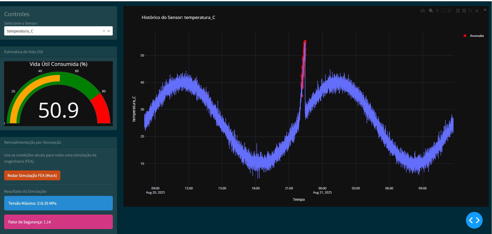

# MVP de Gêmeo Digital para Componentes de Caminhão


Este projeto é um MVP (Minimum Viable Product) funcional de um Gêmeo Digital (Digital Twin) para monitoramento de componentes de um caminhão, com foco inicial em um para-sol da cabine. Inspirado conceitualmente no [Bosch Digital Fuel Twin](https://www.bosch-mobility.com/en/solutions/software-and-services/digital-fuel-twin/), o sistema realiza monitoramento, diagnóstico e prognóstico com base em dados de sensores simulados.

O objetivo é demonstrar um ciclo completo: desde a aquisição de dados até a visualização interativa, detecção de anomalias, estimativa de vida útil e retroalimentação com simulações de engenharia (FEA).

## 📸 Screenshot do Painel




## ✨ Principais Funcionalidades

-   **Geração de Dados Sintéticos**: Criação de um dataset realista com 10.000 amostras, incluindo anomalias pré-definidas (impactos, superaquecimento, falha de sensor).
-   **Dashboard Interativo**: Interface web construída com Dash e Plotly para visualização das séries temporais dos sensores.
-   **Detecção Automática de Anomalias**: Utilização do modelo `IsolationForest` (ou método 3-Sigma) para identificar e destacar eventos anômalos no painel.
-   **Estimativa de Vida Útil**: Cálculo de um índice de dano cumulativo (regra de Miner simplificada) para estimar a vida útil consumida e restante do componente.
-   **Ciclo de Retroalimentação com Simulação FEA (Mock)**: Um botão no painel aciona um script que simula uma análise de elementos finitos (FEA), usando os dados atuais como entrada e exibindo os resultados (tensão máxima, fator de segurança) para "fechar o ciclo" do Gêmeo Digital.

## 📁 Estrutura do Projeto

```
C:\Users\<SEU_USUARIO>\digital_twin_mvp\
│  README.md
│  .gitignore
│  requirements.txt
│  sunvisor_simulated_data.csv
│  anomalies.csv
│  life_estimate.csv
│  main_dashboard.py
│  life_model.py
│  generate_data.py
│
├─fea\
│  │  input_fea.json
│  │  output_fea.json
│  └  mock_fea_solver.py
│
└─img\
   └  dashboard_screenshot.png
```

## 🛠️ Tecnologias Utilizadas

-   **Linguagem**: Python 3.10+
-   **Bibliotecas Principais**:
    -   `pandas` e `numpy` para manipulação de dados.
    -   `scikit-learn` para detecção de anomalias.
    -   `dash`, `plotly` e `dash-bootstrap-components` para o painel web.

## 🚀 Instalação e Execução

Siga os passos abaixo para rodar o projeto localmente.

**1. Clone o Repositório:**
```bash
git clone https://github.com/Milioni-Pedro/digital-twin-mvp-truck.git
cd C:\Users\a350748\digital_twin_mvp
```

**2. Crie e Ative o Ambiente Virtual:**
```powershell
# Crie o ambiente
python -m venv .venv

# Ative o ambiente no PowerShell
 
```

**3. Instale as Dependências:**
O arquivo `requirements.txt` contém todas as bibliotecas necessárias.
```bash
pip install -r requirements.txt
```

**4. Execute o Projeto (em ordem):**
É necessário executar os scripts na sequência correta, pois eles geram os arquivos de dados que os scripts seguintes consomem.

   **a. Gere os dados simulados:**
   ```bash
   python generate_data.py
   ```
   *Isso cria o `sunvisor_simulated_data.csv`.*

   **b. Calcule a estimativa de vida útil:**
   *Este script lê os dados gerados e realiza a detecção de anomalias internamente, mas para o dashboard final, primeiro rodamos o modelo de vida.*
   ```bash
   python life_model.py
   ```
   *Isso cria o `life_estimate.csv`.*

   **c. Inicie o Painel Interativo:**
   *Este script lê os arquivos CSV e inicia o servidor web.*
   ```bash
   python main_dashboard.py
   ```
   *Isso também cria o `anomalies.csv` na primeira execução.*

   **5. Acesse o Painel:**
   Abra seu navegador e acesse a URL: [http://127.0.0.1:8050/](http://127.0.0.1:8050/)

## 📈 Plano de Evolução

Este MVP é a base para um sistema de Gêmeo Digital completo. Os próximos passos naturais seriam:
-   [ ] **Dados Reais**: Integrar com sensores de IoT de um caminhão real.
-   [ ] **Hospedagem em Nuvem**: Migrar a aplicação para um serviço como AWS, Azure ou Google Cloud.
-   [ ] **API de Simulação**: Substituir o mock de FEA por uma chamada de API a um solver na nuvem (ex: SimScale).
-   [ ] **Modelos Avançados**: Utilizar Redes Neurais (LSTMs) para prognósticos mais precisos de RUL (Remaining Useful Life).

## 📄 Licença

Distribuído sob a licença MIT. Veja o arquivo `LICENSE` para mais detalhes.